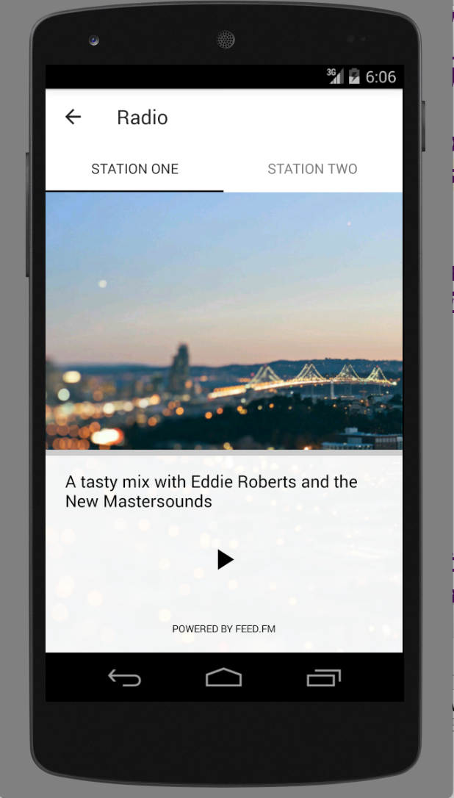
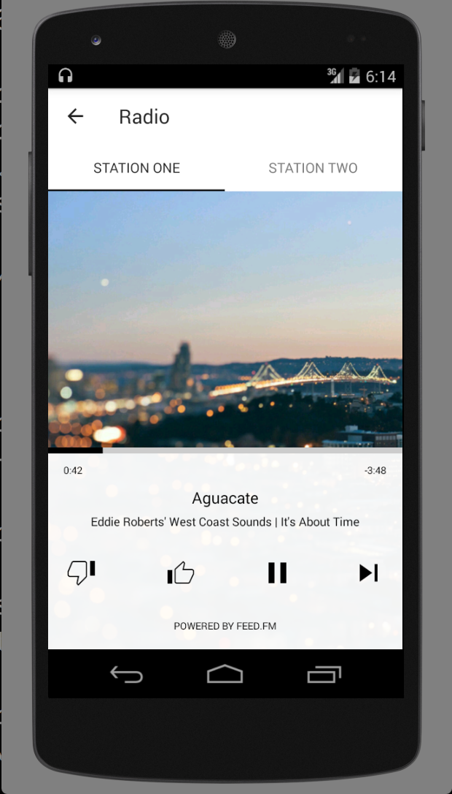
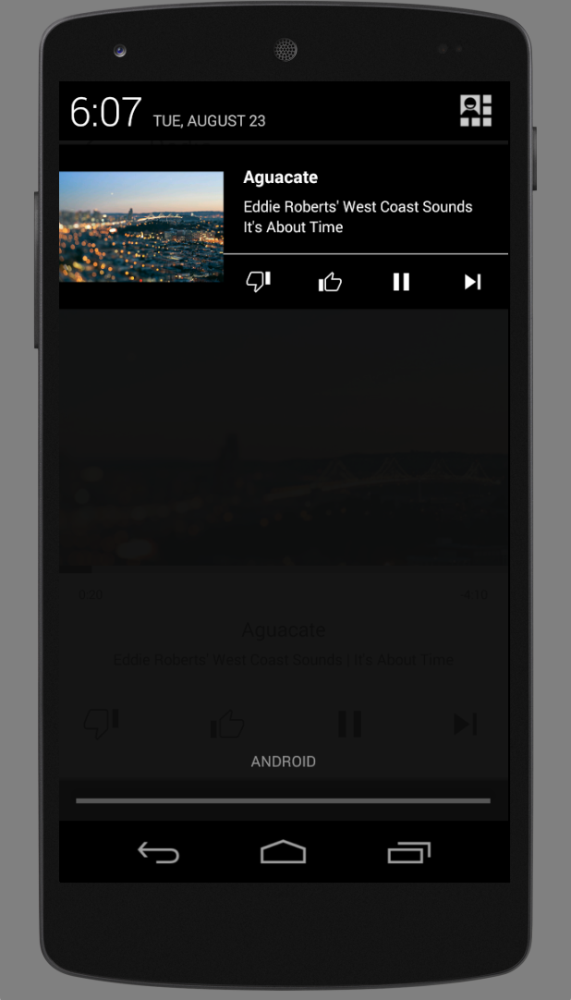
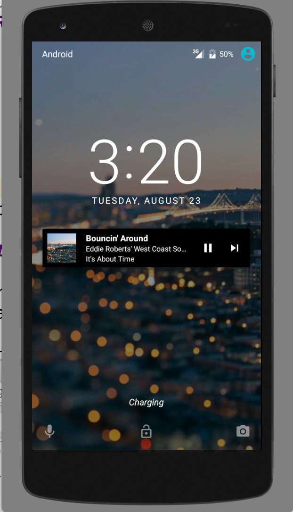

# Android-RadioPlayer
This is a demo Android app that makes use of the Feed Media SDK
to power a Pandora-style Internet-radio app. The app has a sample
custom notification layout and shows how you can use station
metadata to hide stations and assign images and
descriptive text to them.

This player will retrieve the list of stations to display
from the server and display or hide the station selector
accordingly. Background images for the music stations
are provided to the client along with station meta-data.
If background aren't provided by the server, there is a
default image included with this code.

Check out our [iOS version](https://github.com/feedfm/iOS-RadioPlayer) as well!

# Android-RadioPlayer Demo Setup from scratch
To setup the **Andriod-RadioPlayer** demo from scratch using Android Studio, follow the steps below. The demo is mainly to help familiarize new developers with the player and allow testing and interaction with the base UI components. To view instructions on integration into an existing application, scroll down to **Integrate the Android-RadioPlayer into an existing application**.

## Download Android Studio
If you have not already, [download Andriod Studio](https://developer.android.com/studio/index.html) and followup the setup instructions [here](https://developer.android.com/studio/install.html).

## Clone the Andriod-RadioPlayer repository
To obtain the Andriod-RadioPlayer demo code, clone the Github repository:
````
git clone https://github.com/feedfm/Android-RadioPlayer.git
````

## Import the Andriod-RadioPlayer project into Android Studio
In order to interact with the Andriod-RadioPlayer in Android Studio, you must import the project.

### To import the project

1. Go to **File > Import Project** or by selecting **Import project** from the Android Studio start screen.
2. After selecting **Import Project**, use the browse menu to navigate to the location of the cloned **Android-RadioPlayer** project. Select the root directory of the project `Andriod-RadioPlayer`.
3. Click OK. **NOTE:** You may be asked what type of project you are importing, select **Import project from external model** and select the **Gradle** option.
4. It is possible you may receive messages about missing plugin dependencies through out the import process. If this happens, click the installation link to resolve the missing dependency. You may need to install several updates before the process is complete.
5. After the import has begun, you will notice a `Gradle Syc` process start. The progress of this process will be displayed in the bottom status bar of Android Studio.
6. Be sure to let the `Grade Syc` process complete before moving on. You will know the process is complete when you see a message that says "Gradle build finished in X seconds"

## View the Andriod-RadioPlayer project files
To view the source files of the demo project, click on the `Project View` from the left side menu (or use CMD+1 shortcut).

## Run the Android-RadioPlayer project
To run the project, you must have a virtual device or USB device setup with in Android Studio. To learn more about creating and managing virtual devices, please read the [ADV Developer guide](https://developer.android.com/studio/run/managing-avds.html).

### Quick virtual device setup.
If you do not have a virtual device setup, you can use the following steps to use a pre-provisioned device.

1. Select **Tools > Android > AVD Manager**
2. Click on **Create Virtual Device**
3. Ensure that **Phone** is selected under the category menu to the left.
4. Select an existing phone from the menu on the right (for example: Nexus 6) and click Next.
5. On the next screen, **Select a system image**, select the latest Andriod release from the **Recommended** tab and click Next. **NOTE**: You may be prompted to download the image if you haven't already. Follow the download instructions and you will be returned to the system image screen.
6. On the **Verify Configuration** screen, you can customize any options you wish. It is fine for this project preview to leave the default options in-place and click Next.
7. You should now see your new device listed in the Virtual Device Manager. Close the Device manager.

### Running the project
You should setup a virtual or physical device detailed in the steps above. After setting up your device, you can run the Andriod-RadioPlayer demo on your device.

1. Select **Run > Run 'radioplayer'**
2. Select your desired virual or physical device and click OK.

# Screenshots






# Integrate the Android-RadioPlayer into an existing application
You can add this player to your app with minimal coding by following the steps below:

## Clone the Andriod-RadioPlayer repository
To obtain the Andriod-RadioPlayer code, clone the Github repository:
````
git clone https://github.com/feedfm/Android-RadioPlayer.git
````

Or you may download the latest release here: [https://github.com/feedfm/Android-RadioPlayer/archive/master.zip](https://github.com/feedfm/Android-RadioPlayer/archive/master.zip)

## Import the module

1. Open your app in Android Studio.
2. Select **File > New > Import Module**.
3. Select the `playeractivity` directory from with in the root directory of the repository.

## Setup Dependencies

1. After importing, a new `playeractivity` module should appear in your application.
2. Make your application dependent on this new module by opening your applications `build.gradle` file and adding the following to the `dependencies` section:

```groovy
dependencies {
  // ...

  compile project(':playeractivity')

  // ...
}
```

## Initialization
You will need to make sure you initialize the Feed.fm library when
your app starts up.

This should happen in a custom `Application` subclass:

```java

import fm.feed.android.Player;
// ...

public class Application extends android.app.Application {

  // ...

  public void onCreate() {
    super.onCreate();

    // ...

    // initialize player
    Player.setTokens(this, "sdkdemo", "sdkdemo");
  }

  // ...

}
```

**NOTE**: Be sure to replace `sdkdemo` with credentials given to you by Feed.fm.

## Behavior
### Hiding buttons
In any activity that will link to the music player, you should default to hiding the buttons to that access the player.

### Show buttons once music is available
Add the following to the Activity's `onCreate` method to un-hide the buttons once music is confirmed available:

```java
import fm.feed.android.playersdk.Player;
import fm.feed.android.playersdk.PlayerAvailabilityListener;

public class MyActivity extends AppCompatActivity {

	// ...

  protected void onCreate(Bundle savedInstanceState) {
    // ...

    // this should be done before calling findViewById below
    setContenView(/* ... */);

    // make buttons visible if radio is available
    Player.getInstance().onPlayerAvailability(new PlayerAvailabilityListener() {
       @Override
       public void onAvailable() {
         // In this method, make all your hidden buttons that access
         // radio visible.
         findViewById(R.id.playerButton).setVisibility(View.VISIBLE);
       }

       @Override
       public void onUnavailable() {
         // You can leave this empty if, by default, you do not offer
         // access to music in your UI.

         // If you really want to disappoint your user, you could run the following:
         Toast.makeText(MyActivity.this, "Sorry, music is not available to you right now", Toast.LENGTH_LONG).show();
        }
    });

    // ...
  }
}
```
## Player Activity
To pull up the music player activity, construct an Intent with the following:

```java
import fm.feed.android.radioplayer.tabbed.PlayerActivity;

// ...

Intent ai = new Intent(mContext, PlayerActivity.class);

// if you want an 'up' button displayed, then tell the player
// where the up button goes to:
ai.putExtra(PlayerActivity.EXTRA_PARENT_ACTIVITY, new Intent(mContext, MainActivity.class));

// (or, alternatively, edit the activity in the `playeractivity`
// module to have an `android:parentActivityName` attribute)

startActivity(ai);

```

### Run your app, sit back, and groove!
